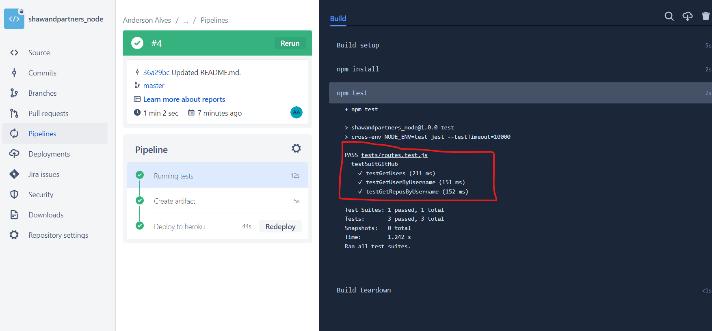

# Documentation

### Requirements

You need to install the NodeJS for run in local environment;

### Description

- For run the local environment I am using the `nodemon` for refresh automatically.
- The `axios` is for get response for the GitHub API;
- The `cors` for ignore cross-env problem;
- The `dotenv` for get env vars;
- The `express` is the framework, there is a next.js, but I am using express;
- The `jest` for execute tests;

### Local environment

Endpoints:

- http://localhost:8080/api/users?per_page=1&since=711314

- http://localhost:8080/api/users/brunobertolini/details

- http://localhost:8080/api/users/brunobertolini/repos?per_page=1&page=1

### Production environment

Endpoints:

- https://shawandpartnersnode.herokuapp.com/api/users?per_page=1&since=711314

- https://shawandpartnersnode.herokuapp.com/api/users/brunobertolini/details

- https://shawandpartnersnode.herokuapp.com/api/users/brunobertolini/repos?per_page=1&page=1

Deployment and tests are running using bitbucket-pipelines.

- Test:

Thanks...  :)